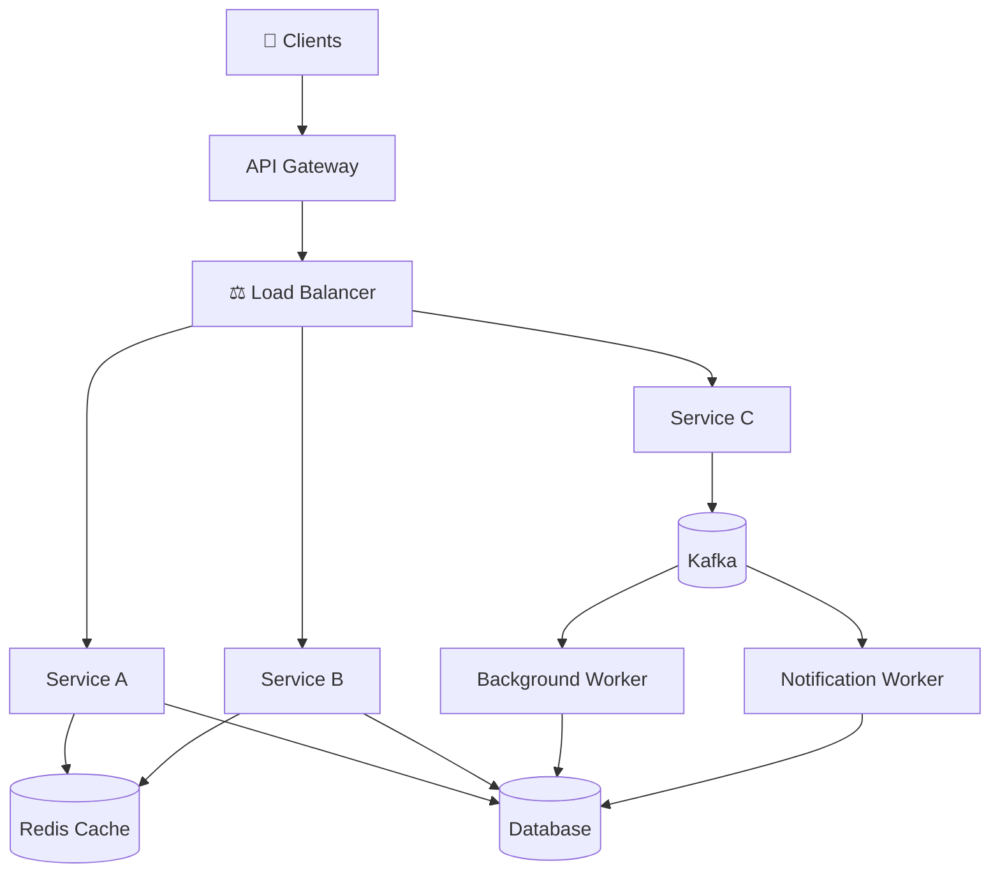

<div align="center">

# 🏗️ High-Level System Design (HLD)

### Learn • Design • Build • Scale

> 🚀 **I'm actively learning High-Level System Design (HLD) and Distributed Systems, and continuously updating this repository with new concepts, architecture diagrams, design trade-offs, and hands-on implementations.**

<p>


</p>

### 👨‍💻 Created & Maintained by **Vansh Singh**

_A practical guide to mastering scalable systems through theory, architecture diagrams, design trade-offs, and production-style implementations._

---

**Distributed Systems** • **System Design** • **Scalability** • **Architecture Patterns** • **Real-World Projects**

</div>

---

# 📖 About

> **🚧 This repository is my living learning journal.**

I'm currently learning **High-Level System Design (HLD)** and **Distributed Systems**, and I actively update this repository as I learn new concepts, study real-world architectures, and build production-style implementations.

Instead of maintaining scattered notes across different platforms, I wanted to create a single place where I can document my complete learning journey—from fundamental distributed system concepts to designing large-scale applications used by millions of users.

The goal of this repository is not only to understand **how systems are built**, but also to understand **why they are designed that way**, the engineering trade-offs behind every decision, and how these concepts can be implemented in real-world systems.

Every topic is accompanied by:

- 📝 Easy-to-understand explanations
- 🏗️ Architecture diagrams
- ⚖️ Design trade-offs
- 💻 Practical implementations
- 📚 References for deeper learning

Since I'm still learning, this repository will continue to grow with new concepts, improvements, and implementations over time.

---

# 🎯 Goals

This repository aims to:

- Learn High-Level System Design from scratch
- Understand Distributed Systems fundamentals
- Master scalability patterns
- Build production-inspired backend systems
- Prepare for System Design interviews
- Create a long-term engineering knowledge base
- Share my learning journey with the community

---

# 📈 Learning Progress

| Topic                           | Status         |
| ------------------------------- | -------------- |
| Back of the Envelope Estimation | ✅ Completed   |
| Consistent Hashing              | ✅ Completed   |
| CAP Theorem                     | ⏳ In Progress |
| Rate Limiting                   | ⏳ In Progress |
| Load Balancing                  | 🔜 Planned     |
| Caching                         | 🔜 Planned     |
| Distributed Databases           | 🔜 Planned     |
| Kafka                           | 🔜 Planned     |
| URL Shortener                   | 🚧 Building    |
| Notification Service            | 🚧 Building    |

> This table will be updated regularly as I continue learning.

---

# 🗺️ Learning Roadmap

```text
Distributed Systems Fundamentals
            │
            ▼
Back-of-the-Envelope Estimation
            │
            ▼
Networking
            │
            ▼
Databases & Storage
            │
            ▼
Caching
            │
            ▼
Load Balancing
            │
            ▼
Rate Limiting
            │
            ▼
Message Queues
            │
            ▼
Distributed Databases
            │
            ▼
Real-World System Design
            │
            ▼
Production-Level Implementations
```

---

# 🏛️ Repository Structure

```text
HLD-PREPARATION/
│
├── Concepts/
│   ├── Back of the Envelope
│   ├── CAP Theorem
│   ├── Consistent Hashing
│   ├── Caching
│   ├── Rate Limiting
│   ├── Load Balancing
│   ├── Replication
│   ├── Partitioning
│   └── ...
│
├── System Designs/
│   ├── URL Shortener
│   ├── Chat Application
│   ├── Notification Service
│   ├── Video Streaming
│   ├── Ride Sharing
│   ├── Search Engine
│   └── ...
│
├── Implementations/
│   ├── Token Bucket
│   ├── Sliding Window
│   ├── URL Shortener
│   ├── Consistent Hashing
│   ├── Bloom Filter
│   └── ...
│
├── Assets/
│
└── README.md
```

---

# 🧠 Topics Covered

## 📚 Fundamentals

- Scalability
- Availability
- Reliability
- Fault Tolerance
- Latency vs Throughput
- Horizontal vs Vertical Scaling
- Back of the Envelope Estimation

---

## 🌐 Networking

- DNS
- HTTP / HTTPS
- TCP / UDP
- WebSockets
- gRPC

---

## 💾 Databases

- SQL vs NoSQL
- Database Indexing
- Replication
- Sharding
- Partitioning
- Transactions

---

## ⚙️ Distributed Systems

- CAP Theorem
- PACELC
- Consistent Hashing
- Distributed Locks
- Leader Election
- Consensus
- Service Discovery

---

## ⚡ Performance

- Redis
- Caching Strategies
- CDN
- Cache Invalidation
- Bloom Filters

---

## 🚀 Scalability

- Load Balancers
- API Gateway
- Auto Scaling
- Reverse Proxy

---

## 📨 Messaging

- Kafka
- RabbitMQ
- Event Streaming
- Pub/Sub
- Event Driven Architecture

---

## 🛡️ Reliability

- Rate Limiting
- Circuit Breaker
- Retry Mechanism
- Dead Letter Queue
- Idempotency

---

# 🏗️ Real-World System Design Projects

This repository will include architecture discussions for systems such as:

- URL Shortener
- TinyURL
- WhatsApp
- Instagram
- Twitter / X
- YouTube
- Netflix
- Uber
- Zomato
- Google Drive
- Dropbox
- Notification Service
- Search Engine
- Distributed Cache
- Payment Gateway
- News Feed

More projects will be added as I continue learning.

---

# 💻 Hands-on Implementations

Understanding theory is only half the journey.

Along with design concepts, I also build practical implementations to understand how these systems work internally.

Some implementations include:

- Token Bucket Rate Limiter
- Sliding Window Rate Limiter
- Leaky Bucket
- URL Shortener
- Consistent Hashing
- Bloom Filter
- LRU Cache
- Distributed ID Generator
- Load Balancer
- Message Queue

---

# 🏛️ Example Architecture



---

# 📚 Learning Resources

This repository is inspired by some incredible engineers, books, and educational platforms.

## 📖 Books

- Designing Data-Intensive Applications
- System Design Interview Volume 1
- System Design Interview Volume 2

---

## 🌐 Websites

- ByteByteGo
- High Scalability
- Martin Fowler
- AWS Architecture Center
- Google Cloud Architecture

---

## 🎥 YouTube

- ByteByteGo (Alex Xu)
- Concept & Coding (Shrayansh)
- Asli Engineering (Arpit Bhayani)
- Gaurav Sen

---

# 🤝 Contributions

Although this repository primarily documents **my learning journey**, suggestions, improvements, and discussions are always welcome.

If you find any mistakes or have better approaches, feel free to:

- Open an Issue
- Submit a Pull Request
- Start a Discussion

Let's learn together.

---

# 🚀 What's Next?

I'm continuously working on adding:

- More distributed system concepts
- Better architecture diagrams
- Production-ready implementations
- Interview-focused explanations
- Real-world case studies
- Code walkthroughs

Stay tuned for regular updates!

---

# ⭐ Support

If you found this repository helpful, please consider giving it a **⭐ Star**.

It motivates me to continue learning, building, and sharing everything I discover along the way.

---

<div align="center">

## 🚀 Happy Learning!

### Made with ❤️ by **Vansh Singh**

_"Learning never stops, and neither will this repository."_

</div>
